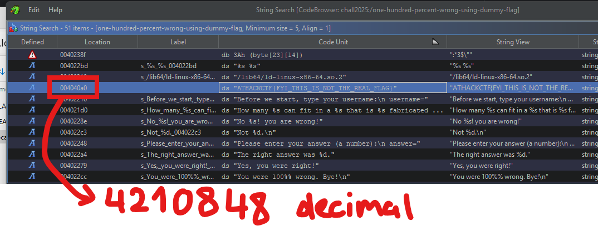

# Solution
The challenge revolves around a format string vulnerability, and the flag is a harcoded string. The flag can be easily
dumped once its address is known.

## Quick PoC
```
# Replace port and ip with real ones
nc 127.0.0.1 2025

# Enter "%d %s" when asked for username
# Enter "4210848" when asked for answer
# Get the flag
```

## Locating the address
- Open the flagless binary `one-hundred-percent-wrong-using-dummy-flag` using Ghidra
- Inspect strings and locate flag address (`0x4040a0 == 4210848`)

  
